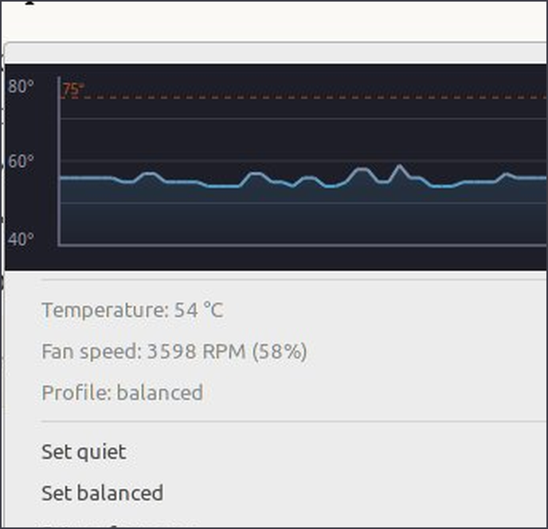
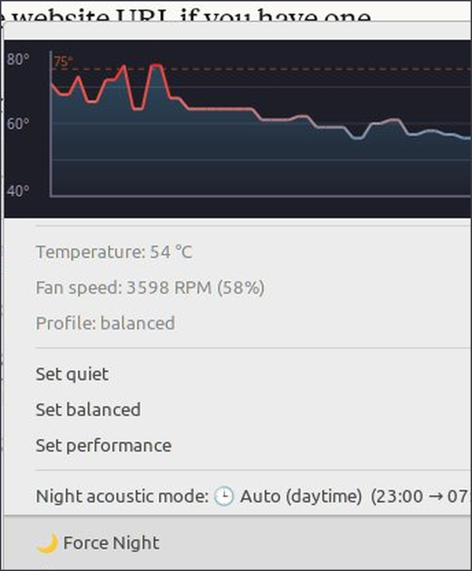

# Zenfan

Adaptive fan control suite for **ASUS Zenbook UX31e** running **LMDE 7** (Linux Mint Debian Edition) with the **Cinnamon** desktop.


---

## Screenshots

| Main view | Night mode menu |
|-----------|----------------|
|  |  |

---

## Features

- **Three fan profiles** — quiet, balanced, performance with adaptive thermal curves
- **Night acoustic mode** — automatic fan limiter during configurable quiet hours
- **Adaptive learning** — offset adjusts over time to your system's thermal behaviour
- **Predictive cooling** — detects rapid temperature rises before throttling occurs
- **Real RPM tachometer** — reads `fan1_input` directly; falls back to PWM estimation (marked `~`) when daemon has manual control
- **BIOS Auto awareness** — when daemon is inactive, applet detects BIOS auto mode, disables controls, shows `⚙` indicator
- **Cinnamon panel applet** — live temperature graph, colour-reactive by heat level, one-click profile switching
- **GTK config GUI** — dark-themed night schedule editor with live preview
- **No password prompts** — sudoers NOPASSWD scoped to a single write helper

---

## Repository Structure

```
zenfan/
├── bin/
│   ├── zenbook-fan.sh          # Main daemon (runs as root via systemd)
│   ├── zenfan                  # Fan profile CLI (quiet/balanced/performance/status)
│   ├── zenfan-night            # Night mode override CLI (on/off/auto/status)
│   ├── zenfan-night-effective  # Resolves current auto mode state
│   ├── zenfan-write-conf       # Privileged write helper (called via sudo)
│   └── zenfan-config-gui       # GTK night schedule editor
├── applet/
│   ├── applet.js               # Cinnamon panel applet
│   └── metadata.json           # Applet metadata
├── config/
│   ├── zenfan.conf             # Default unified config
│   ├── org.zenfan.policy       # polkit policy
│   └── zenfan-sudoers          # sudoers drop-in
├── systemd/
│   └── zenfan.service          # systemd service unit
├── docs/
│   ├── screenshots/            # Applet screenshots
│   ├── HARDWARE.md             # hwmon path detection and hardware notes
│   ├── PROFILES.md             # Fan profile thermal curves explained
│   ├── NIGHT_MODE.md           # Night mode logic explained
│   └── INSTALL.md              # Manual installation steps
├── install.sh                  # Automated installer
├── uninstall.sh                # Clean removal script
├── CHANGELOG.md
└── README.md
```

---

## Requirements

| Requirement | Version |
|-------------|---------|
| OS | LMDE 7 (Bookworm base) |
| Desktop | Cinnamon 6.x |
| CJS | 128.0+ |
| Python | 3.11+ |
| Python GTK | `python3-gi`, `gir1.2-gtk-3.0` |
| systemd | any |
| polkit | 126+ |

---

## Quick Install

```bash
git clone https://github.com/GayratTursunov/zenfan.git
cd zenfan
bash install.sh
```

The installer will:
1. Detect hwmon paths and warn if they differ from defaults
2. Install all binaries to `/usr/local/bin/`
3. Create `/etc/zenfan.conf` with defaults (if not already present)
4. Install the sudoers rule (NOPASSWD for `zenfan-write-conf` only)
5. Install the polkit policy and reload polkit
6. Enable and start the systemd service
7. Install the Cinnamon applet

Then add the applet to your panel:
> Right-click panel → Applets → search **Zenfan** → Add to panel

---

## Manual Install

See [docs/INSTALL.md](docs/INSTALL.md) for step-by-step manual installation.

---

## Configuration

All settings live in a single file: `/etc/zenfan.conf`

```ini
PROFILE=balanced      # quiet | balanced | performance
NIGHT_START=22        # quiet period start (0-23)
NIGHT_END=7           # quiet period end (0-23)
```

**Change profile from terminal:**
```bash
zenfan quiet
zenfan balanced
zenfan performance
zenfan status
```

**Change night mode from terminal:**
```bash
zenfan-night on       # force quiet always
zenfan-night off      # disable quiet always
zenfan-night auto     # follow schedule
zenfan-night status   # show current setting
```

**Edit quiet hours:**
```bash
zenfan-config-gui
```

---

## Applet display

| State | Panel label | Meaning |
|-------|------------|---------|
| Cool, daemon active | `❄ 52°` | Normal operation |
| Warm | `🌡 63°` | Mid-range temperature |
| Hot | `🔥 78°` | High temperature |
| Night mode active | `❄ 52° 🌙` | Quiet hours in effect |
| Daemon inactive | `❄ 52° ⚙` | BIOS auto control |

**Fan speed display:**
- `4100 RPM (65%)` — live tachometer + PWM percent (daemon active)
- `3900~ RPM (65%)` — PWM-estimated RPM rounded to nearest 100 (manual control)
- `4100 RPM` — live tachometer, no percent (daemon inactive / BIOS auto)
- `N/A` — tachometer returned invalid value (> 15000 RPM)

---

## Hardware Paths

| Path | Purpose |
|------|---------|
| `/sys/class/hwmon/hwmon2/temp1_input` | CPU temperature |
| `/sys/class/hwmon/hwmon4/pwm1` | Fan PWM control (0–255, effective 0–200) |
| `/sys/class/hwmon/hwmon4/pwm1_enable` | 1=manual, 2=auto |
| `/sys/class/hwmon/hwmon4/fan1_input` | Real RPM tachometer |

See [docs/HARDWARE.md](docs/HARDWARE.md) for detection instructions if your indices differ.

---

## Privilege Model

| Operation | Method | Requires |
|-----------|--------|----------|
| Read temperature / PWM / RPM | sysfs file read | None |
| Read config | File read | None |
| Write config (profile/schedule) | `sudo zenfan-write-conf` | NOPASSWD (sudoers.d) |
| Night mode override | Write to `/tmp` | None |
| Fan PWM control | systemd daemon runs as root | systemd |

---

## Settings

Right-click the applet → **Configure** (or Applets → Zenfan → gear icon) to set:

- **Panel refresh interval** (1–10 s) — higher means lower idle CPU/power
- **hwmon chip names** (advanced) — override the `coretemp` / `asus` auto-detection if your hardware differs

---

## Development

Lint everything (bash syntax, Python compile, JSON, JS syntax, shellcheck):

```bash
bash tools/lint.sh
```

The same gate runs in CI on every push/PR ([.github/workflows/ci.yml](.github/workflows/ci.yml)).
To run it automatically before each commit:

```bash
git config core.hooksPath .githooks
```

---

## Uninstall

```bash
bash uninstall.sh
```

---

## Changelog

See [CHANGELOG.md](CHANGELOG.md)

---

## License

MIT — see [LICENSE](LICENSE)
